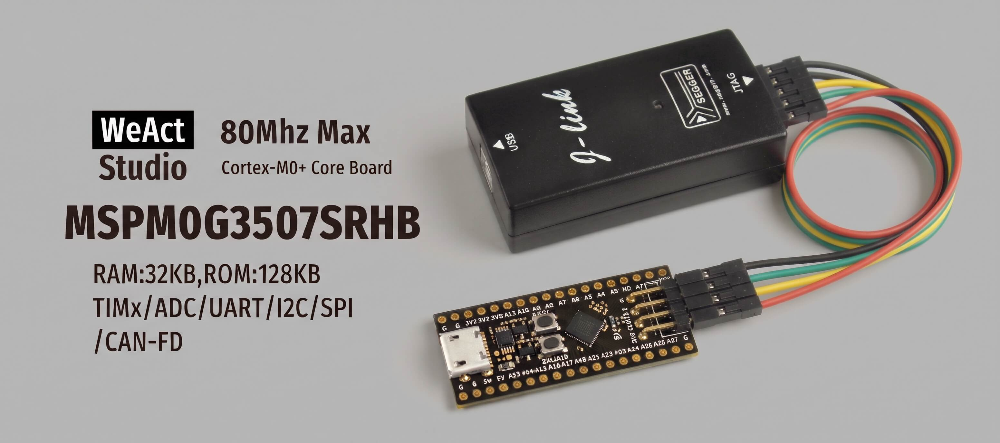
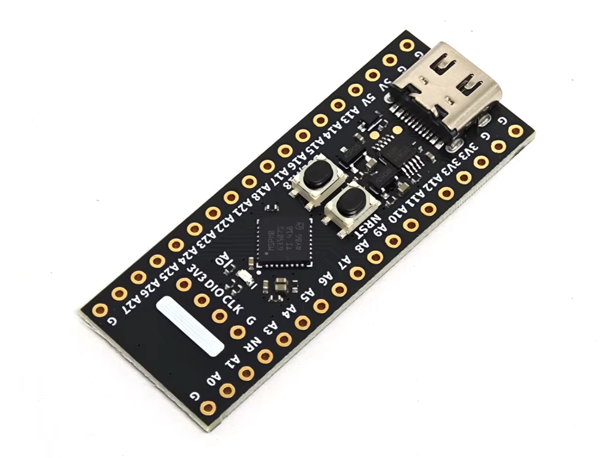
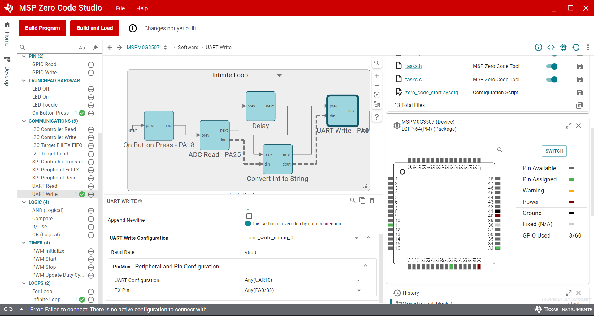

# MSP Zero Code Studio — Flash `.out` to MSPM0G3507 via J-Link



How-to flash `.out` files from **MSP Zero Code Studio** (TI Clang toolchain) to the **MSPM0G3507** chip using **J-Link**.

**Target Board**: [WeAct Studio MSPM0G3507 Core Board](https://github.com/WeActStudio/WeActStudio.MSPM0G3507CoreBoard/)

---

## Hardware

| Component | Specification |
|-----------|---------------|
| **Target Board** | WeAct Studio MSPM0G3507 Core Board |
| **MCU** | TI MSPM0G3507 (Cortex-M0+, 512KB Flash, 128KB RAM) |
| **Programmer** | J-Link (SEGGER), connected via SWD (2-pin: SWCLK, SWDIO) |



---

## Quick Start

```powershell
git clone https://github.com/Muhammad-Yunus/MSP-Zero-Code-Studio-Jlink-Loader.git
cd MSP-Zero-Code-Studio-Jlink-Loader

# Flash default firmware
bash scripts/flash.sh
# Or with PowerShell
.\scripts\flash.ps1
```

---

## Script Usage

All scripts automatically detect the TI toolchain, J-Link, and GDB paths.

### Flash Firmware

```powershell
bash scripts/flash.sh                    # default firmware
bash scripts/flash.sh firmware/my_app.out
.\scripts\flash.ps1 -Firmware firmware\my_app.out
```

### Convert `.out` to `.hex` or `.bin`

```powershell
bash scripts/convert.sh firmware/my_app.out hex
bash scripts/convert.sh firmware/my_app.out bin
.\scripts\convert.ps1 -Format hex
.\scripts\convert.ps1 -Format bin
```

### Change GDB Server Port

```powershell
PORT=2332 bash scripts/flash.sh
```

---

## Firmware: ADC Sample to UART Write

The `firmware/` folder contains a demo firmware from **MSP Zero Code Studio** — the **ADC Sample to UART Write** example project. The firmware is a clean ELF (`.out`) file taken directly from the compiler workspace folder, not the exported version (exported files are usually corrupted due to Unicode replacement characters).

This demo reads ADC input and prints the result via UART — ideal for hardware validation before flashing your own firmware.

### Dependencies

To generate your own `.out` firmware, make sure the following tools are installed:

- **[MSP Zero Code Studio](https://www.ti.com/tool/MSP-ZERO-CODE-STUDIO)** — TI's visual IDE for configuring and generating code for MSPM0 MCUs
- **[J-Link Software](https://www.segger.com/downloads/jlink/)** — SEGGER's debugger/programmer (used: **V8.44**)

With these two tools combined, you no longer need an XDS debugger board (LaunchPad) for flashing — simply connect J-Link to the SWD header on the board.



---

## Prerequisites

| Tool | Default Location |
|------|-----------------|
| **J-Link** | `C:\Program Files\SEGGER\JLink_V844\` |
| **GDB** | STM32CubeIDE `...\tools\bin\arm-none-eabi-gdb.exe` |
| **TI Tools** | `<PATH_MSP_ZEROCODE_STUDIO>\ti_cgt_arm_llvm\bin\` |

Find GDB location if not in PATH:
```powershell
where.exe arm-none-eabi-gdb
```

---

## Important Notes

### Why are exported `.out` files corrupted?

Files exported from MSP Zero Code Studio contain `0xEF 0xBF 0xBD` bytes (Unicode replacement characters), which corrupt the ELF header. Use the original file from the compiler workspace folder instead:

```
<PATH_MSP_ZEROCODE_STUDIO>\workspace\<project_name>\Debug\<project_name>.out
```

Example:
```
C:\Users\<username>\guicomposer\runtime\gcruntime.v13\MSPZeroCodeStudio\workspace\<project_name>\Debug\<project_name>.out
```

---

## Troubleshooting

| Problem | Solution |
|---------|----------|
| `Failed to open file` in JLink | Use a path without spaces, or copy the file to the repo root |
| `invalid e_shentsize in ELF header` | Exported file is corrupted. Copy from the workspace Debug folder |
| `loadfile` crash in tiarmhex | Use `tiarmobjcopy` to generate `.bin`, then flash via GDB |
| Port 2331 already in use | Change port: `PORT=2332 bash scripts/flash.sh` |
| GDB `load` fails without "Transfer rate" | Add `monitor halt` before `load` |
| `tiarmhex.exe` segmentation fault | ELF file is corrupt. Use the workspace Debug version or generate `.bin` with `tiarmobjcopy` |
